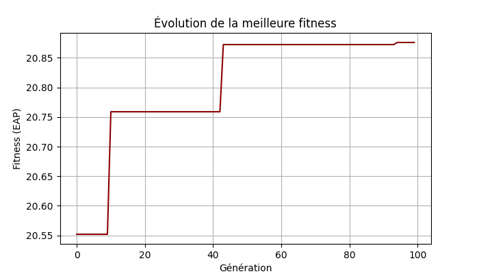

# Optimisation avancée — Implantation optimale d'un parc éolien

> Projet d'**optimisation numérique sous contraintes** (M2 Ingénierie Numérique, Polytech Nice-Sophia / Université Côte d'Azur).
> Implémentation *from scratch* et comparaison de plusieurs algorithmes d'optimisation sur un problème industriel en **boîte noire** (*blackbox*).

---

## Le problème

Placer `N` éoliennes sur un site pour **maximiser la production annuelle d'énergie (EAP)**, sous deux contraintes :

- **Espacement** minimal entre éoliennes (effet de sillage / *wake effect*),
- **Appartenance à la zone** autorisée (frontières + zones d'exclusion).

La fonction objectif n'a **pas de gradient analytique** : chaque évaluation passe par un simulateur coûteux qui renvoie `(EAP, violation_espacement, violation_placement)`. C'est un cas typique d'**optimisation en boîte noire sous contraintes**.

> La fonction d'évaluation provient du framework **AMON** (fourni dans le cadre du cours, non inclus ici). Le code de ce dossier correspond à **mon travail personnel** : les algorithmes d'optimisation et leur analyse.

---

## Algorithmes implémentés

- **Algorithme génétique** (`algo_gen.py`), entièrement codé :
  - génération d'individus **valides** (placement aléatoire avec rejet sur la contrainte d'espacement),
  - **sélection par tournoi**, **croisement barycentrique**, **mutation gaussienne** bornée,
  - **élitisme** (conservation du meilleur individu d'une génération à l'autre),
  - **pénalisation** des solutions violant les contraintes,
  - **cache de fitness** pour éviter de réévaluer la blackbox coûteuse.
- **Méthodes de gradient** : montée de gradient (`ascend_grad.py`), **gradient à pas adaptatif** (`grad_pas_adapt.py`), gradient appliqué au problème éolien (`gradientWind.py`), avec **étude de sensibilité au pas**.
- **Comparaison** à la résolution de référence par **NOMAD** (solveur sans dérivées, algorithme MADS) fournie dans AMON.

---

## Résultats

*Évolution de la meilleure fitness (EAP) au fil des générations — algorithme génétique.*

---

## Compétences mises en œuvre

- **Optimisation** : métaheuristiques (algorithme génétique), méthodes de gradient, optimisation **sans dérivées** (NOMAD / MADS), gestion des **contraintes** par pénalisation.
- **Méthodo** : benchmarking contre un solveur de référence, maîtrise du **coût d'évaluation** (cache, génération de solutions admissibles).
- **Python** : NumPy, Matplotlib, notebooks, structuration du code.

---

## Contenu du dossier

| Fichier | Description |
|---|---|
| `algo_gen.py` | Algorithme génétique complet |
| `ascend_grad.py` | Montée de gradient |
| `grad_pas_adapt.py` | Gradient à pas adaptatif |
| `gradientWind.py` | Gradient appliqué au parc éolien |
| `windValid.py` | Validation |
| `generate.ipynb` | Notebook d'analyse et de visualisation |
| `figures/` | Courbes de convergence et tracés d'implantation |

---

*Auteur : Charles — [github.com/d3etox](https://github.com/d3etox)*
